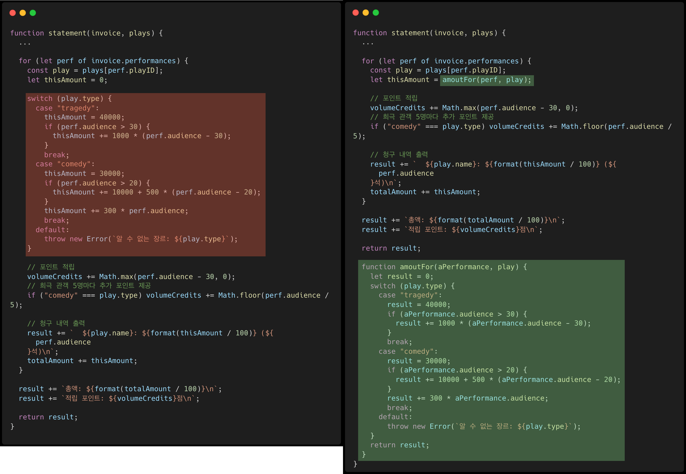
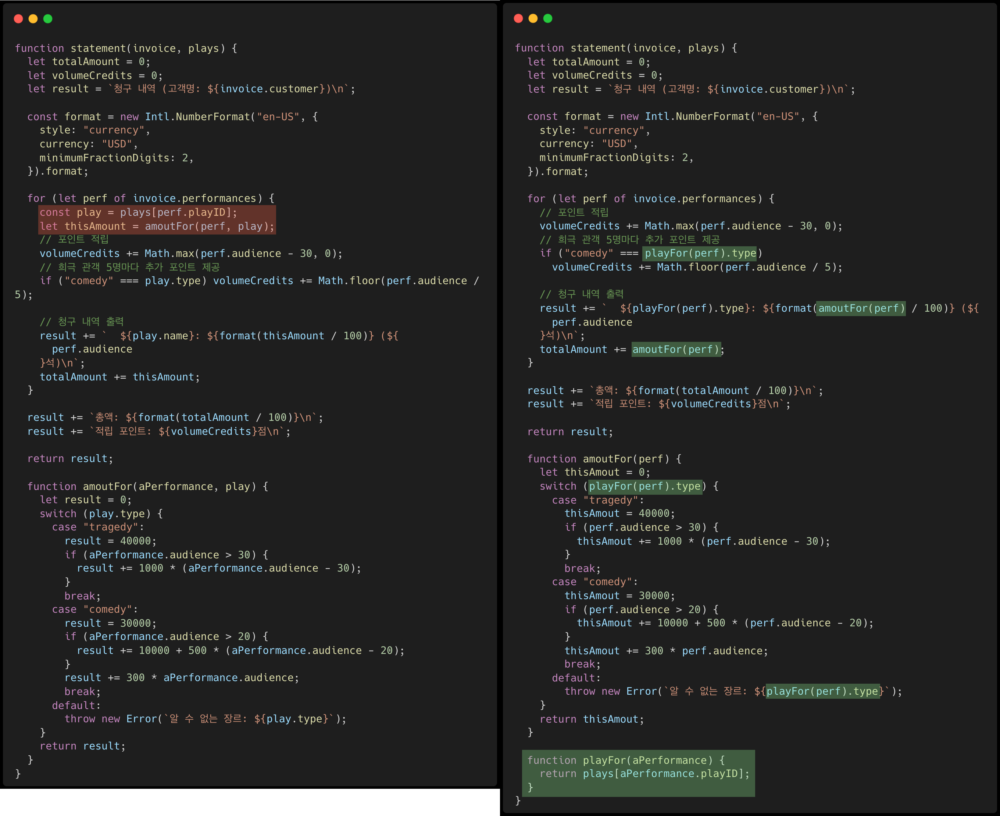
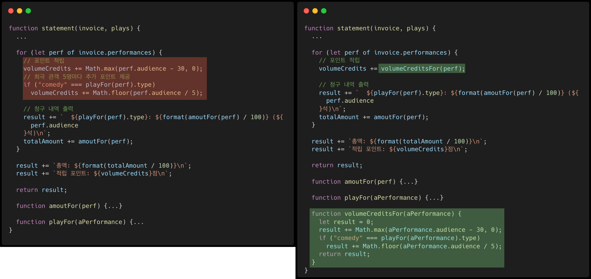
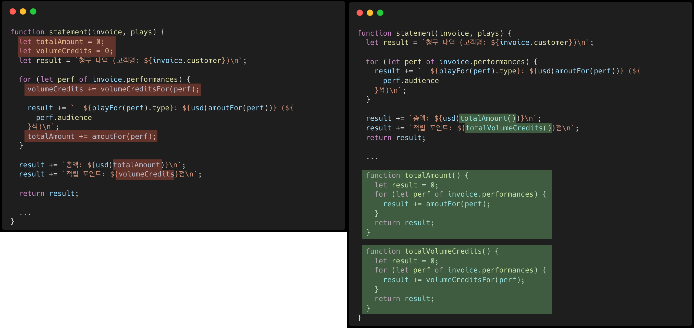
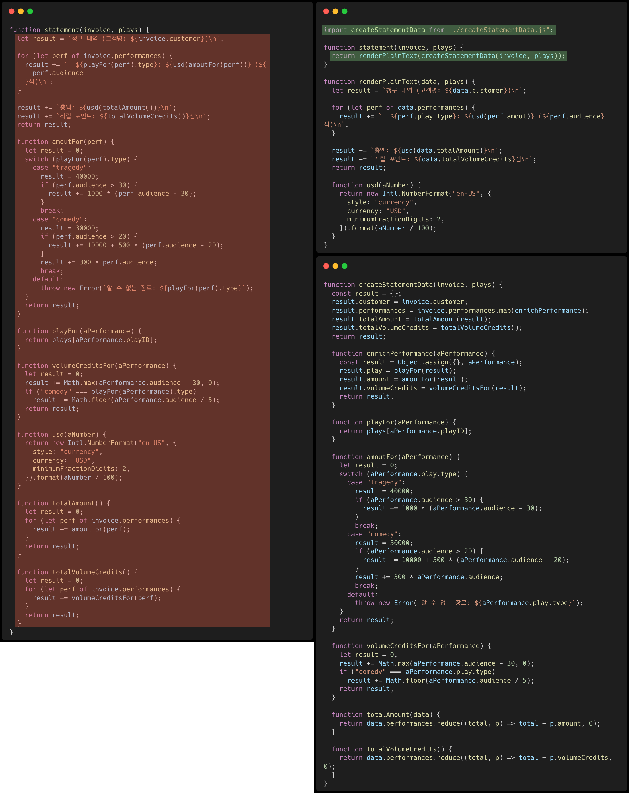
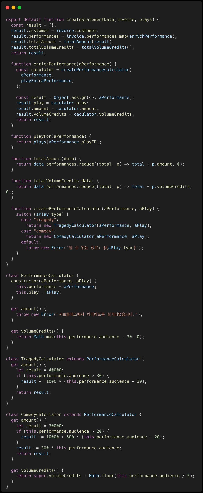

# 리팩터링

- [리팩터링의 첫 단계](#리팩터링의-첫-단계)
- [중간 점검: 난무하는 중첩 함수](#중간-점검-난무하는-중첩-함수)
- [중간 점검: 두 파일(과 두 단계)로 분리됨](#중간-점검-두-파일과-두-단계로-분리됨)
- [다형성을 활용해 계산 코드 재구성하기](#다형성을-활용해-계산-코드-재구성하기)

## 리팩터링의 첫 단계

- 리팩터링의 첫 단계는 리팩터링할 코드 영역을 꼼꼼하게 검사해줄 테스트 코드들부터 마련해야 한다. 리팩터링에서 테스트의 역할은 굉장히 중요하다. 실제 작업은 사람이 수행하기 때문에 언제든 실수할 수 있다.
- 리팩터링 후 이전과 동작의 결과가 같아야 한다.
- 컴파일-테스트-커밋

### 함수 추출하기

- 별도 함수로 빼냈을 때 유효범위를 벗어나는 변수, 즉 새 함수에서는 곧바로 사용할 수 없는 변수가 있는지 확인한다.
- amoutFor()를 statement()의 중첩 함수로 만들어, 바깥 함수에서 쓰던 변수를 새로 추출할 함수에 매개변수로 전달할 필요가 없어서 편하다. -> `Closure`

_왼쪽: Before / 오른쪽: After_


### play 변수 제거하기

- amoutFor()의 매개변수 play는 개별 공연(aPerformance)에서 얻기 때문에 매개변수로 전달할 필요가 없다. 긴 함수를 잘게 쪼갤 때마다 play 같은 변수를 최대한 제거한다.
- 임시 변수를 질의 함수로 바꾸기 - playFor(aPerformance)



### 적립 포인트 계산 코드 추출하기



### format 변수 제거하기

- 임시 변수는 나중에 문제를 일으킬 수 있다. 임시 변수는 자신이 속한 루틴에섬나 의미가 있어서 루틴이 길고 복잡해지기 쉽다. 따라서 다음으로 할 리팩터링은 이런 변수들을 제거하는 것이다.


### volumeCredits 변수 제거하기

- 반복문 쪼개기로 volumeCredits 값이 누적되는 부분을 따로 빼낸다.
- 이어서 문장 슬라이드하기를 적용해서 volumeCredits 변수를 선언하는 문장을 반복문 바로 앞으로 옮긴다.
- 반복문을 쪼개서 성능이 느려지지 않을까 걱정할 수 있다. 이 정도 중복은 성능에 미치는 영향이 미미할 때가 많다.
- 하지만 '대체로 그렇다'와 '항상 그렇다'는 엄연히 다르다. 때로는 리팩터링 성능에 상당한 영향을 주기도 한다. 그런 경우라도 개의치 않고 리팩터링한다. 잘 다듬어진 코드라야 성능 개선 작업도 훨씬 수월하기 때문이다.
- 리팩터링 때문에 성능이 떨어진다면, 하던 리팩터링을 마무리하고 나서 성능을 개선하자.



## 중간 점검: 난무하는 중첩 함수

- 최상위의 statement() 함수는 이제 단 일곱 줄뿐미여, 출력할 문장을 생성하는 일만 한다.
- 계산 로직은 모두 여러 개의 보조 함수로 빼냈다.
- 결과적으로 각 계산 과정은 물론 전체 흐름을 이해하기가 훨씬 쉬워졌다.

```js
function statement(invoice, plays) {
  let result = `청구 내역 (고객명: ${invoice.customer})\n`;

  for (let perf of invoice.performances) {
    result += `  ${playFor(perf).type}: ${usd(amoutFor(perf))} (${
      perf.audience
    }석)\n`;
  }

  result += `총액: ${usd(totalAmount())}\n`;
  result += `적립 포인트: ${totalVolumeCredits()}점\n`;
  return result;

  function amoutFor(perf) {
    let result = 0;
    switch (playFor(perf).type) {
      case "tragedy":
        result = 40000;
        if (perf.audience > 30) {
          result += 1000 * (perf.audience - 30);
        }
        break;
      case "comedy":
        result = 30000;
        if (perf.audience > 20) {
          result += 10000 + 500 * (perf.audience - 20);
        }
        result += 300 * perf.audience;
        break;
      default:
        throw new Error(`알 수 없는 장르: ${playFor(perf).type}`);
    }
    return result;
  }

  function playFor(aPerformance) {
    return plays[aPerformance.playID];
  }

  function volumeCreditsFor(aPerformance) {
    let result = 0;
    result += Math.max(aPerformance.audience - 30, 0);
    if ("comedy" === playFor(aPerformance).type)
      result += Math.floor(aPerformance.audience / 5);
    return result;
  }

  function usd(aNumber) {
    return new Intl.NumberFormat("en-US", {
      style: "currency",
      currency: "USD",
      minimumFractionDigits: 2,
    }).format(aNumber / 100);
  }

  function totalAmount() {
    let result = 0;
    for (let perf of invoice.performances) {
      result += amoutFor(perf);
    }
    return result;
  }

  function totalVolumeCredits() {
    let result = 0;
    for (let perf of invoice.performances) {
      result += volumeCreditsFor(perf);
    }
    return result;
  }
}
```

### 계산 단계와 포맷팅 단계 분리하기

- statement()의 HTML 버전을 만드는 작업 전, 분리된 계산 함수들을 텍스트 버전과 HTML 버전 함수 모두에서 재사용하게 만들고 싶다.
- 단계 쪼개기: statement()의 로직을 두 단계로 나누기
- 첫 번째 단계에서는 두 번째 단계로 전달할 중간 데이터 구조를 생성하는 것이다.



## 중간 점검: 두 파일(과 두 단계)로 분리됨

- 처음보다 코드량이 부쩍 늘었다.
- 계산하는 부분과 출력 형식을 다루는 부분이 분리됐다.
- 이렇개 모듈화하면 각 부분이 하는 일과 그 부분들이 맞물려 돌아가는 과정을 파악하기 쉬워진다.
- 모듈화한 덕분에 계산 코드를 중복하지 않고도 HTML 버전을 만들 수 있었다.

> statement.js...

```js
import createStatementData from "./createStatementData.js";

function statement(invoice, plays) {
  return renderPlainText(createStatementData(invoice, plays));
}

function renderPlainText(data, plays) {
  let result = `청구 내역 (고객명: ${data.customer})\n`;

  for (let perf of data.performances) {
    result += `  ${perf.play.type}: ${usd(perf.amout)} (${perf.audience}석)\n`;
  }

  result += `총액: ${usd(data.totalAmount)}\n`;
  result += `적립 포인트: ${data.totalVolumeCredits}점\n`;
  return result;

  function usd(aNumber) {
    return new Intl.NumberFormat("en-US", {
      style: "currency",
      currency: "USD",
      minimumFractionDigits: 2,
    }).format(aNumber / 100);
  }
}

function htmlStatement(invoice, plays) {
  return renderHtml(createStatementData(invoice, plays));
}

function renderHtml(data) {
  let result = `<h1>청구 내역 (고객명: ${data.customer})</h1>\n`;
  result += "<table>\n";
  result += "<tr><th>연극</th><th>좌석수</th><th>금액</th></tr>";
  for (let perf of data.performances) {
    result += `  <tr><td>${perf.play.name}</td><td>${perf.audience}</td>`;
    result += `<td>${usd(perf.amount)}</td></tr>\n`;
  }
  result += "</table>\n";
  result += `<p>총액: <em>${usd(data.totalAmount)}</em></p>\n`;
  result += `<p>적립 포인트: <em>${data.totalVolumeCredits}</em>점</p>\n`;
  return result;

  function usd(aNumber) {
    return new Intl.NumberFormat("en-US", {
      style: "currency",
      currency: "USD",
      minimumFractionDigits: 2,
    }).format(aNumber / 100);
  }
}
```

> createStatementData.js

```js
function createStatementData(invoice, plays) {
  const result = {};
  result.customer = invoice.customer;
  result.performances = invoice.performances.map(enrichPerformance);
  result.totalAmount = totalAmount(result);
  result.totalVolumeCredits = totalVolumeCredits();
  return result;

  function enrichPerformance(aPerformance) {
    const result = Object.assign({}, aPerformance);
    result.play = playFor(result);
    result.amount = amoutFor(result);
    result.volumeCredits = volumeCreditsFor(result);
    return result;
  }

  function playFor(aPerformance) {
    return plays[aPerformance.playID];
  }

  function amoutFor(aPerformance) {
    let result = 0;
    switch (aPerformance.play.type) {
      case "tragedy":
        result = 40000;
        if (aPerformance.audience > 30) {
          result += 1000 * (aPerformance.audience - 30);
        }
        break;
      case "comedy":
        result = 30000;
        if (aPerformance.audience > 20) {
          result += 10000 + 500 * (aPerformance.audience - 20);
        }
        result += 300 * aPerformance.audience;
        break;
      default:
        throw new Error(`알 수 없는 장르: ${aPerformance.play.type}`);
    }
    return result;
  }

  function volumeCreditsFor(aPerformance) {
    let result = 0;
    result += Math.max(aPerformance.audience - 30, 0);
    if ("comedy" === aPerformance.play.type)
      result += Math.floor(aPerformance.audience / 5);
    return result;
  }

  function totalAmount(data) {
    return data.performances.reduce((total, p) => total + p.amount, 0);
  }

  function totalVolumeCredits() {
    return data.performances.reduce((total, p) => total + p.volumeCredits, 0);
  }
}
```

## 다형성을 활용해 계산 코드 재구성하기

- 연극 장르를 추가하고 장르마다 공연료와 적립 포인트 계산법을 다르게 지정할 때, amoutFor() 함수의 로직은 코드 수정 횟수가 늘어날수록 골칫거리로 전락하기 쉽다.
- 조건부 로직을 명확한 구조로 보완하는 방법은 다양하지만, 여기서는 객체지향의 핵심 특성인 다형성(polymorphism)을 활용하는 것이 자연스럽다.
- ES6부터 객체지향을 사용할 수 있는 문법과 구조가 제대로 지원되기 시작했다.

### 공연료 계산기 만들기

- 중간 데이터 구조에 채워주는 enrichPerformance() 함수는 조건부 로직을 포함한 함수인 amoutFor()와 volumeCreditsFor()를 호출하여 공연료와 적립 포인트를 계산한다.
- 이 두 함수를 전용 클래스 PerformanceCalculator로 옮긴다.

### 공연료 계산기를 다형성 버전으로 만들기

- 타입 코드 대신 서브클래스를 사용하도록 변경한다.
- PerformanceCalculator의 서브클래스들을 준비하고 createStatementData()에서 그중 적합한 서브클래스를 사용하게 만들어야 한다. 그리고 딱 맞는 서브클래스 사용하려면 생성자 대신 함수를 호출하도록 바꿔야 한다.(JS에서는 생성자가 서브클래스의 인스턴스를 반환할 수 없기 때문)

### 상태 점검: 다형성을 활용하여 데이터 생성하기

- 이번 수정으로 나아진 점은 연극 장르별 계산 코드들을 함께 묶어뒀다는 것이다. 앞으로도 수정 대부분이 이 코드에서 이뤄질 것 같다면 이렇게 명확하게 분리해두면 좋다.
- 이제 새로운 장르를 추가하려면 해당 장르의 서브클래스를 작성하고 생성 함수인 createPerformanceCalculator()에 추가하기만 하면 된다.


